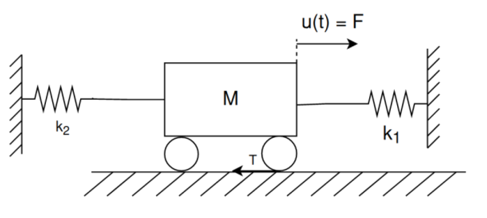

# projektMMM

# Prerequisites
Building:
- CMake
- compiler of choice

Using:
- Gnuplot

# Model wózka na sprężynach z wejściem w postaci siły i tarcia



#Downlowding the realese
If you download an executable file for Linux, after downloading it to your desired directory you must first run
```teminal
chmod +x ./executable-name
```
for your OS to recognize the file as an executable
